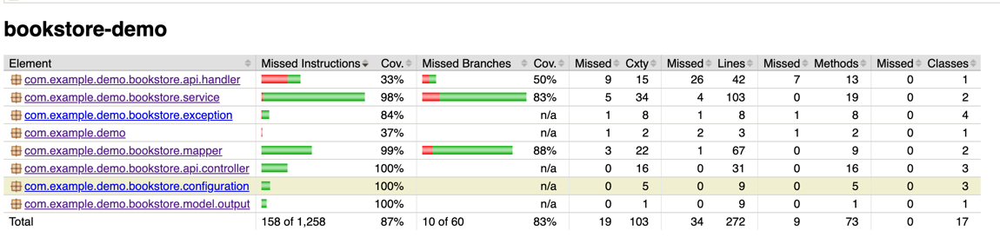

# Bookstore Demo Application

## Background

This is a demo application for online bookstore, providing browsing, purchasing book via end user's browser etc.

It is built on top of Spring Boot framework, since Spring Boot is a great framework for building microservices quickly and easily,
and also the Spring Community is very active and has a lot of great resources and outstanding solutions for common problems.

To simplify demo, here putting book service and cart service into one project.

## Tech Stack

- Java 21
- Spring Boot 3.3.4
- Spring Data JPA
- Hibernate
- H2 Database
- Lombok
- JUnit5
- Mockito
- Mapstruct
- Swagger UI
- Gradle
- Flyway
- RFC-9457

## Error Response

follow [RFC-9457](https://www.rfc-editor.org/rfc/rfc9457.html) specification to response with standard error output, it is clean and easier to align with Frontend or other integration point.

## Api Specification

The api specification is generated by Swagger UI. You can access it via [API Specification](http://localhost:8080/swagger-ui/index.html)

## Api Usage


## How to run the application?

1. Clone this repository
2. Run the following command in the root directory of the project

if you have installed Gradle in your environment, then just run:

```shell
gradle clean bootRun
```

otherwise, then run

```shell
./gradlew clean bootRun
```

## How to run unit test?

1. Clone this repository
2. Run the following command in the root directory of the project

```shell
gradle clean test
```

otherwise, then run

```shell
./gradlew clean test
```

3. Test Report will be generated under

```shell
build/reports/tests/test/index.html
```

## How to run unit test with coverage?

1. Clone this repository
2. Run the following command in the root directory of the project

```shell
gradle clean jacocoTestReport
```

3.Coverage report will be generated under

```shell
build/reports/jacoco/test/index.html
```

4.Report example as following



